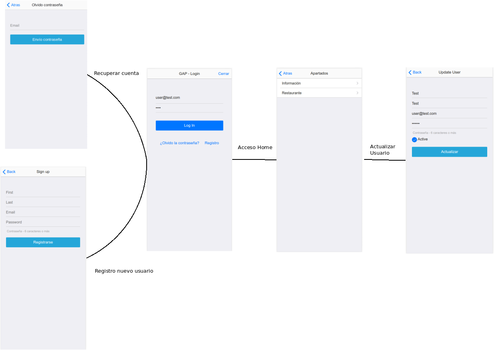
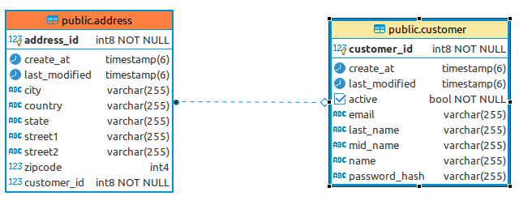
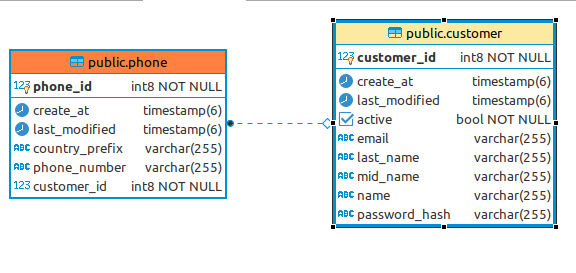
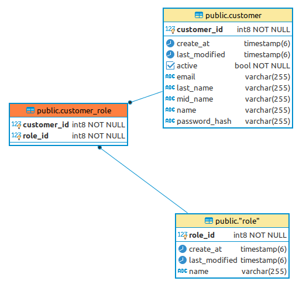
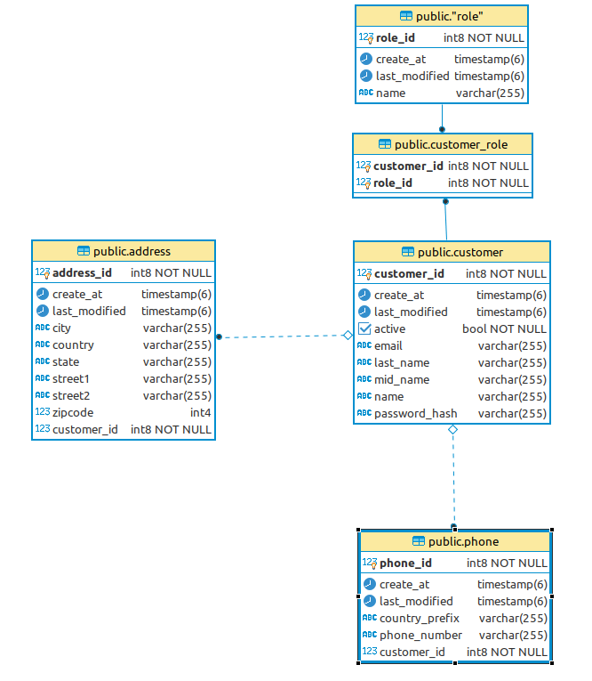

# Spring 1

## User histories

- US_OOO1: Como administrador del sistema quiero identificar a los usuarios para controlar su acceso y restringirlo en caso necesario.
- US_OO02: Como administrador del sistema quiero poder inhabilitar el acceso de un usuario para limitar el acceso en caso necesario.
- US_OOO3: Como cliente quiero poder gestionar mis datos para visualizar, actualizar o borrar dependiendo de de mis necesidades.
- US_OO04: Como administrador del sistema quiero poder forzar el cambio de credencial de acceso de un usuario para garantizar la seguridad de su acceso.

## Diseño de la interfaz

Para los casos de uso anteriormente mencionados se diseña el siguiente flujo de interfaz.

El flujo comprende las acciones necesarias para el "enrollment" y "login" de un usuario, siendo estas acciones las descritas por los casos de uso.

## Diseño de la db

Para dar soporte a las acciones anteriormente descritas, se diseña la siguiente base de datos.

Describimos las relaciones antes de pasar al diagrama general.

- Customer - Addresses (Relación 1 a muchos)

- Customer - Phone (Relación 1 a muchos)

- Customer - Roles (Relación muchos a muchos)

### Digrama general de base de datos

