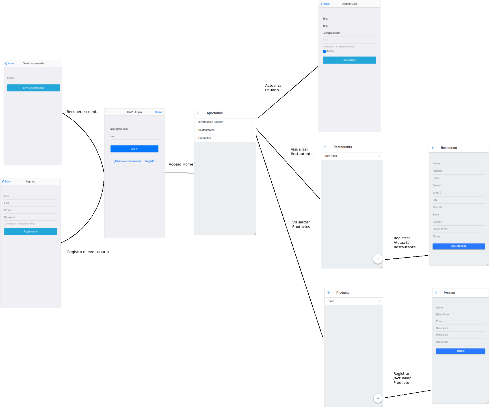
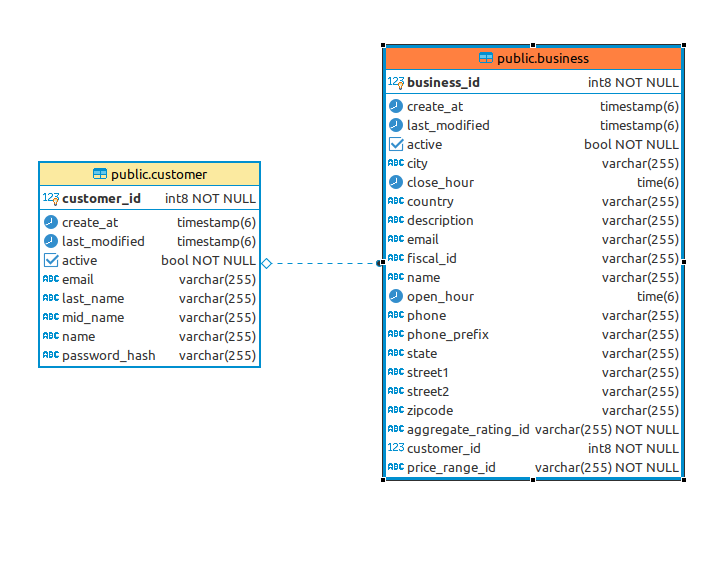
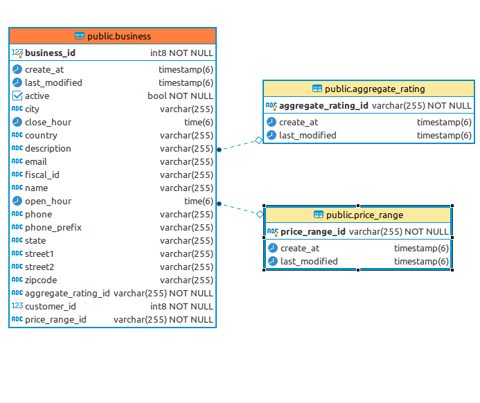
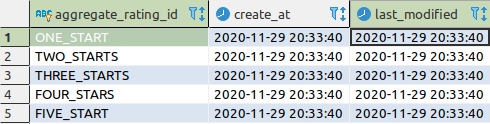
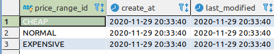
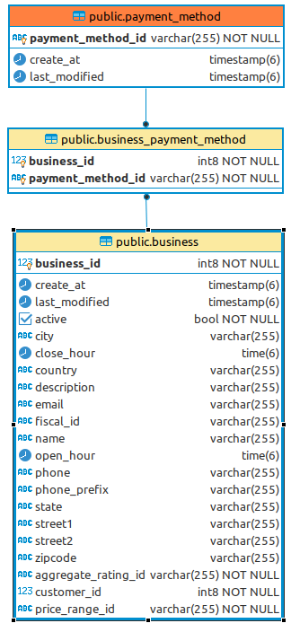
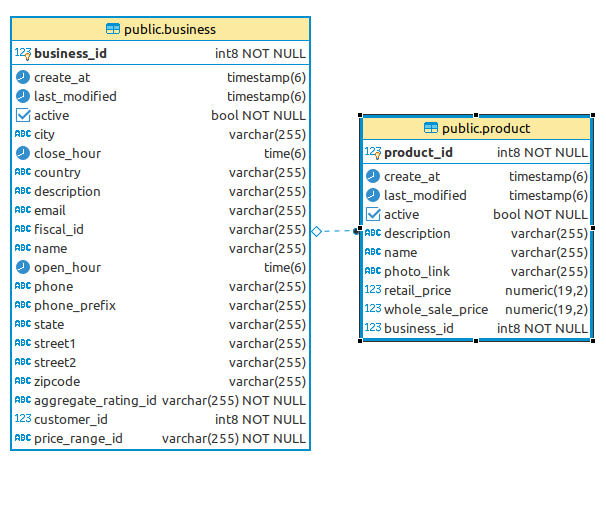
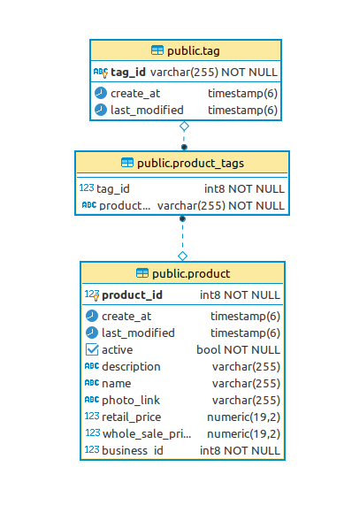
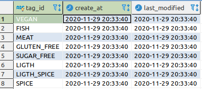
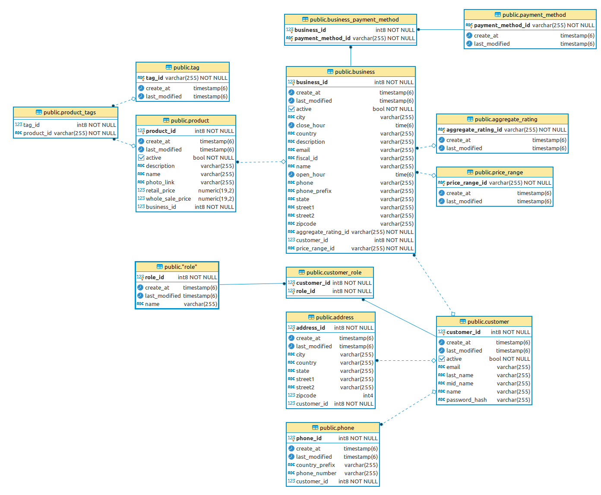

# Spring 2

## User histories

- US_0004: Como administrador del sistema quiero poder forzar el cambio de credencial de acceso de un usuario para garantizar la seguridad de su acceso.
- US_0006: Como propietario de un negocio quiero poder dar de alta mi negocio dentro del sistema para poder ofrecer mis productos.
- US_0005: Como cliente quiero poder cursar la baja en el mismo para ejercitar mi derecho a desistimiento.
- US_0007: Como propietario de un negocio quiero poder dar de alta una carta de productos en mi negocio para que sean seleccionados por los clientes.

## Diseño de la interfaz

Para los casos de uso anteriormente mencionados se diseña el siguiente flujo de interfaz.

El flujo comprende las acciones necesarias para el alta de negocios y productos.

## Diseño de la api Rest

Se añaden los siguientes endpoints, correspondientemente documentados en swagger, a los del primer spring

## Diseño de la db

Para dar soporte a las acciones anteriormente descritas, se diseña la siguiente base de datos.

Describimos las relaciones antes de mostrar el diagrama general actualizado.

- Customer - Business (Relación 1 a muchos)

- Business - Aggregate Rating y Price Range (Relación Muchos a 1): Ambos son valoraciones de los clientes uno hace referencia a la calidad/precio, típica valoración con estrellas y la otra al rango de precios.

Son tablas maestras con valores fijos.

- PaymentMethods - Business (Relación muchos a muchos) Al igual que la anterior, también es una tabla maestra.

- Business - Producto (Relación 1 a muchos)

- Producto - Tags (Relación muchos a muchos) Metadata útil para la búsqueda y segmentación de productos.

### Digrama general de base de datos

## VIDEO DEMOSTRACIÓN DE AVANCE.

https://drive.google.com/file/d/1rg7z2xkT1cSvtQpU2H_f5wmCr7E0uUVG/view?usp=sharing