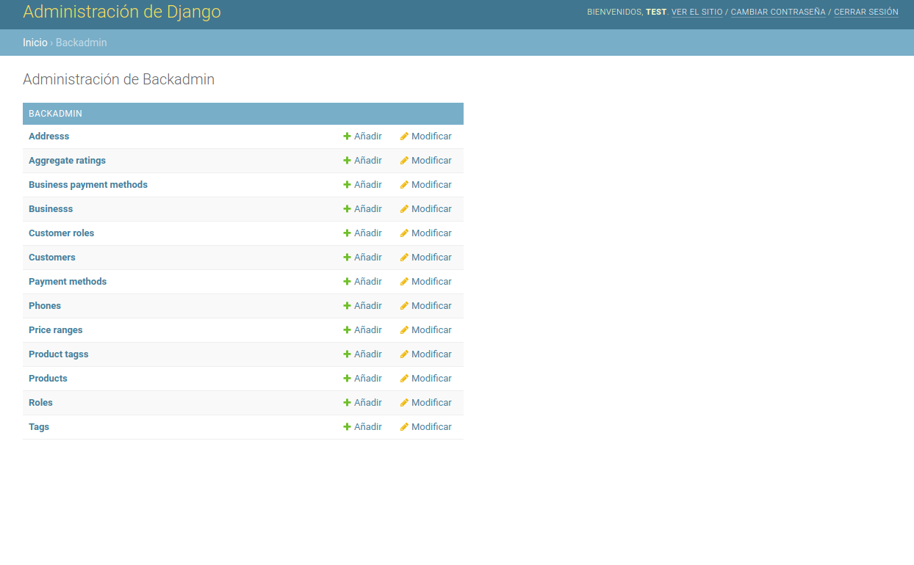
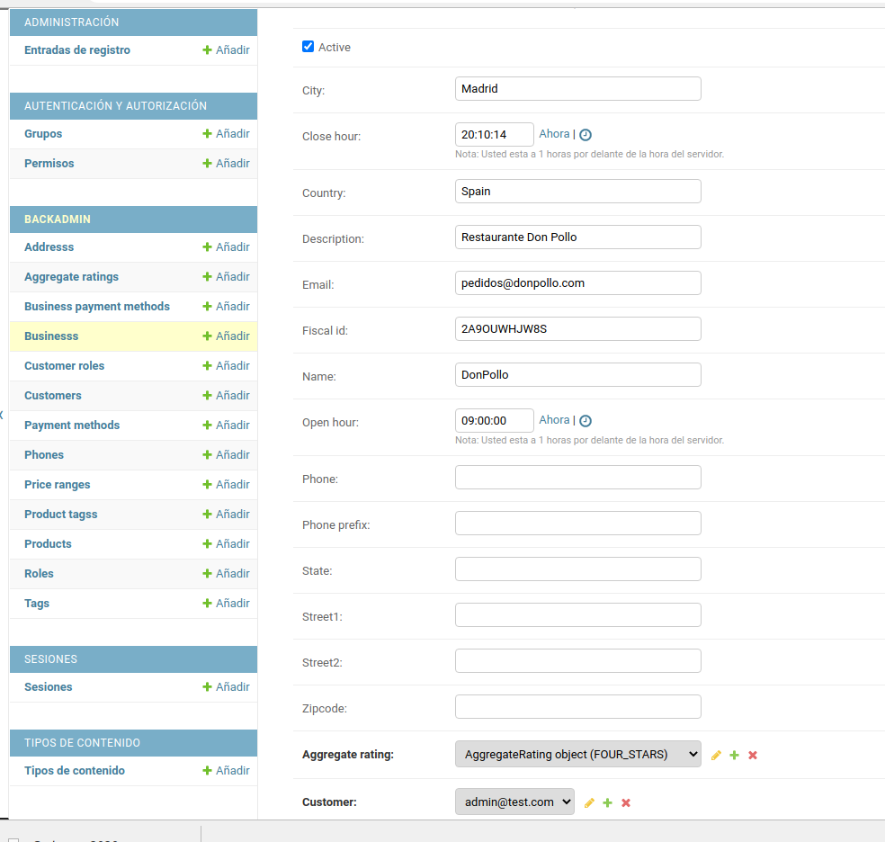
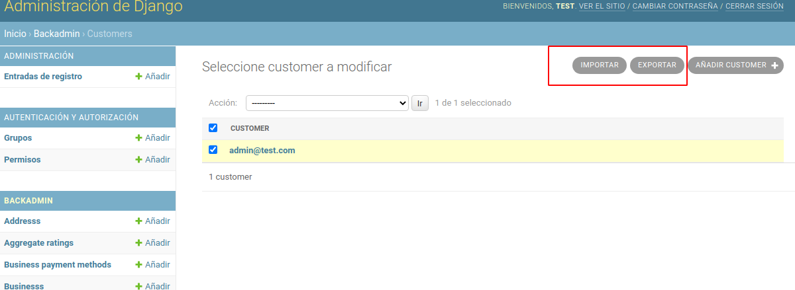
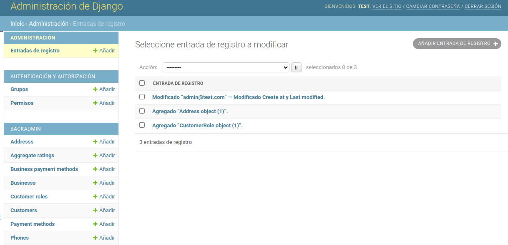
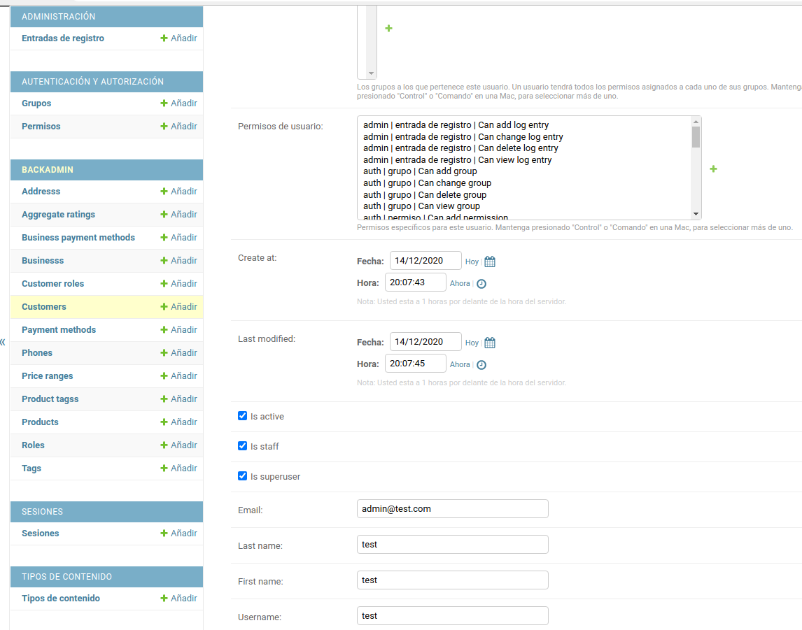
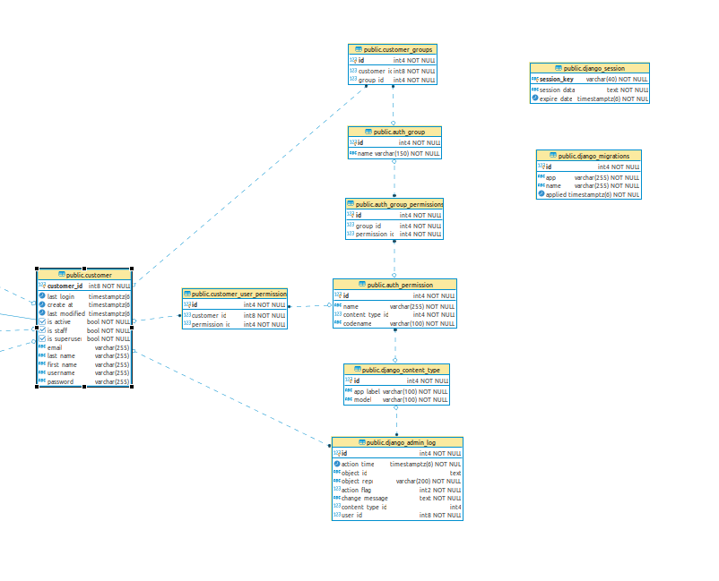
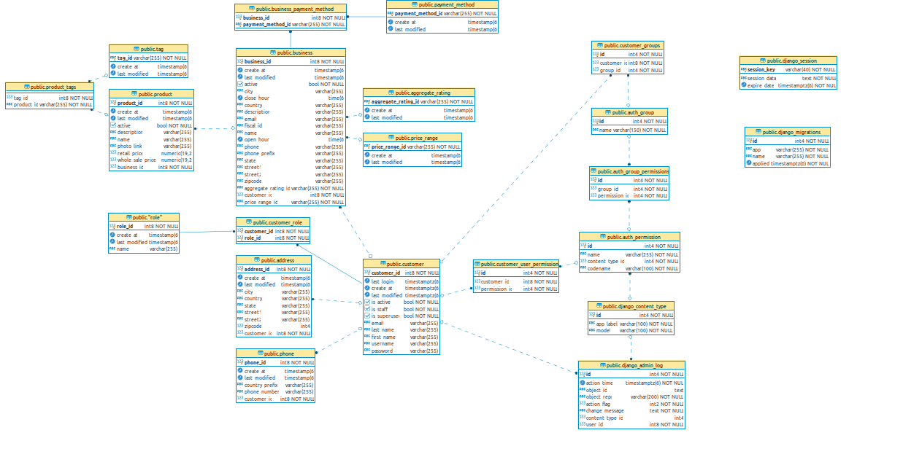

# Spring 3

## User histories

- US_0007: Como propietario de un negocio quiero poder dar de alta una carta de productos en mi negocio para que sean seleccionados por los clientes.
- US_0008: Como propietario de un negocio quier poder gestionar todos los detalles de los productos para mantenerlos actualizados en base a la demanda y al stock.
- US_0009: Como cliente quiero poder darme de alta en el sistema para realizar pedidos en mi nombre.
- US_0011: Como cliente quiero poder visualizar los productos de un negocio para poder realizar pedidos.

## Diseño de la interfaz

Para los casos de uso anteriormente mencionados se diseña el siguiente flujo de interfaz.

El flujo comprende las interfaz de administración así como la gestión de cualquier componente de producto, la idea es dar a los propietarios de productos la categoria de staff y acceso a las tablas producto y negocio de la interfaz de administración.

Queda pendiente la limitación por permisos de acceso a esta interfaz.

Al ser una interfaz de administración que nos provee el framework, omitimos el flujo de diseño y adjuntamos algunos detalles de los casos de uso.

Caso de uso de gestión de la db:

Caso de uso de la gestión de un negocio:

Caso de uso de la generación de reportes:

Caso de uso de auditoria:

Caso de uso de gestión de usuarios:

## Diseño de la db

Para dar soporte a las acciones anteriormente descritas, se diseña la siguiente base de datos.

Describimos las relaciones antes de mostrar el diagrama general actualizado.

Las relaciones se describen de la siguiente manera:
 
 - Un Customer puede tener 0..n Permissions (Relación muchos a muchos)
 - Un Customer puede tener 0..n Groups (Relación muchos a muchos)
 - Un Grupo de permisos puede tener 0..n permisos (Relación muchos a muchos)

Los permisos efectivos son la intersección entre los permisos directamente asociados a el Customer y los pertenecientes a sus Grupos. 

Al final todas estas relaciones son provistas por el propio framework así como la relación de auditoria django_admin_log que será utilizada para generar auditoria de los logins de la aplicación.

Las tablas django_session y django_migrations contienen los token de sessión y los cambios realizados en los schemas de db respectivamente.

### Digrama general de base de datos

## VIDEO DEMOSTRACIÓN DE AVANCE.

https://drive.google.com/file/d/119vBcKptkiOUoCutcJ5AVlsrNxOa0mwY/view?usp=sharing