# Spring 5

## User histories

- US_0013: Como cliente quiero recibir notificaciones del estado de los distintos pedidos para estar informado y tomar acciones en base a la información.
- US_0014: Como cliente quiero tener la posibilidad de cancelar un pedido si este no ha sido atendido aun por el negocio para evitar el cargo económico del mismo.
- US_0015: Como cliente quiero poder pagar mis pedidos a través de la plataforma para evitar el contacto con el repartidor pues es uno de los puntos clave en esta pandemia.
- US_0016: Como administrador del sistemas quiero poder visualizar desde un único sitio todos los eventos del sistema para controlar el estado y detectar contingencias.

## Sistema de notificaciones

Para el sistema de notificaciones vamos a utilizar un patrón publicador-subscriptor con una cola de mensajes como canal de comunicación.

La elección de esta arquitectura es debido a la naturaleza asíncrona de los canales de comunicación ya sean email, sms, o mensajería de cualquier red social.

Además estos sistemas generalmente dependen de un sistema externo, por lo que lograremos el desacoplamiento de nuestro sistema del servicio encargado del envío.

### Colas de mensajes. Apache Kafka.

Las colas de mensajes permiten la comunicación asíncrona, lo que significa que los puntos de conexión que producen y consumen los mensajes interactúan con la cola, no entre sí.

Además, ayudan a simplificar de forma significativa la escritura de código para aplicaciones desacopladas, mejorando el rendimiento, la fiabilidad y la escalabilidad.

### Que es Apache Kafka

Apache Kafka es un sistema de transmisión de datos distribuido con capacidad de escalado horizontal y tolerante a fallos. Gracias a su alto rendimiento nos permite transmitir datos en tiempo real utilizando el patrón de mensajería publish/subscribe.

### Patrón Publish/Subscribe

Es un patrón dentro de la tipología de arquitectura de "Cola de mensajes" utilizado para la comunicación de aplicaciones.

El funcionamiento genérico y salvando mucho las distancias funcionaría como una memoria de intercambio de información o un apartado de correos (Es solamente una metáfora, ahora pasaremos a explicarlo).

Existe un elemento "publisher" (productor) que al generar un dato  no lo dirige o referencia específicamente a un "subscriber" (receptor) en concreto, es decir, no lo envía de forma directa a la "dirección" del subscriber.

Para ello se dispone de listas de temas/topics publicados específicos y un conjunto de suscriptores, el productor trata de clasificar el mensaje en base a una tipología, lo pone en la lista de un tema específico y el receptor se suscribe a la listas para recibir ese tipo de mensajes.

Este tipo de comunicación se utiliza sobre todo para la comunicación asíncrona.

Permite diferentes tipos de configuración:
- Tradicional: Cada suscriptor está asociado a uno o varios topic en concreto. Existen muchas variaciones:
  - Cada suscriptor está escuchando 1 topic propio.
  - Cada suscriptor está escuchando N topics independientes.
  - Cada suscriptor está escuchando N topics independientes y Y topics compartido.
- Grupos de consumo: Los suscriptores se pueden agrupar por grupo, este grupo está escuchando un topic y sólo un miembro del grupo tendrá la capacidad de atender el mensaje.
- Radio Difusión: Todos los suscriptores que están escuchando el topic reciben el mensaje (cada suscriptor es responsable de interpretar el mensaje de forma independiente).

### Diagrama de arquitectura del sistema de notificaciones.

Basados en este patrón, el diagrama de arquitectura del sistema de notificaciones, quedaría de la siguiente manera:

Lo que nos permite esta arquitectura es desacoplar el sistema de backend de la notificaciones, respetando su naturaleza asíncrona y permitiendo escalar a futuro el mismo, sin que haya que tocar el resto del sistema.

### Operaciones del sistema de notificaciones.

El uso del sistema de notificaciones para el sistema GAP esta acotado a los siguientes casos de uso:

- Creación de un pedido
- Modificación de estado
- Cancelación
- Creación de la cuenta de un usuario.
- Cambio de contraseña.
- Cancelación de la cuenta de un usuario.

A continuación presentamos los diagramas de secuencia de los mismo con el fin de representar como interactuá todo el sistema en cada uno de ellos.

#### Creación de un pedido

Para la creación de un pedido, el cliente realiza los pasos de selección de restaurante, selección de productos y pago del mismo.

Una vez realizado el pago. El sistema dispara el sistema de notificaciones con el fin que el cliente tenga un resguardo del mismo y notificar al negocio el nuevo pedido.

En este caso el diagrama representa la notificiación por email, pero la secuencia es análoga para otros canales de comunicación.

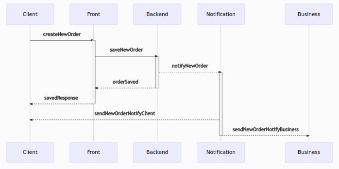

#### Modificación de estado

La modificación de un estado, generalmente es disparada por el negocio, siguiendo el siguiente diagrama de flujo.

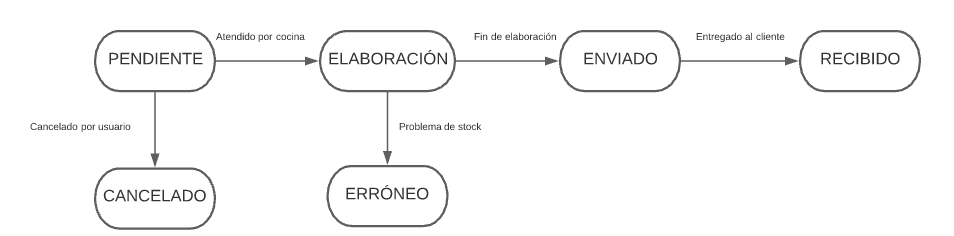

Existen excepciones como pueden ser la cancelación del pedido, pero en general atenderán al cauce generado por el negocio.

En este caso el diagrama de secuencia será el siguiente, el cambio de estado se hará mediante una actualización del pedido.

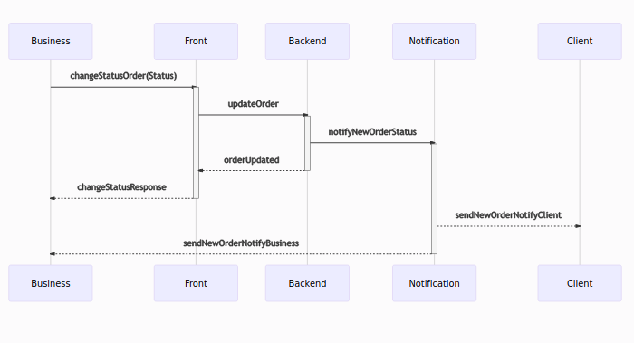

#### Cancelación

La cancelación era la excepción anteriormente planteada a los cambios de estado. Esta se puede realizar cuando el pedido aún no esta en elaboración.

El diagrama de secuencia será el siguiente:

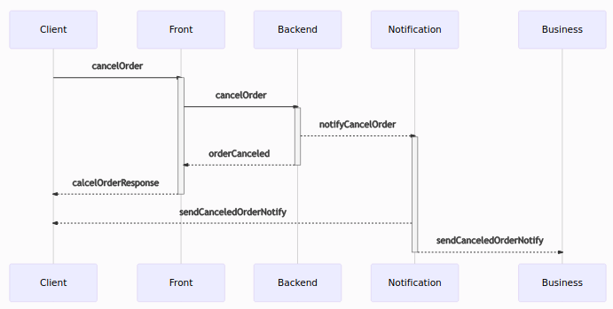
#### Creación de la cuenta de un usuario.

La creación de la cuenta de usuario también vendrá acompañada de un mensaje de bienvenida que sirva como ack de la acción.

En este caso la notifiación se lanzara como parte del flujo de la creación de un cliente.

El diagrama de secuencia es el siguiente:

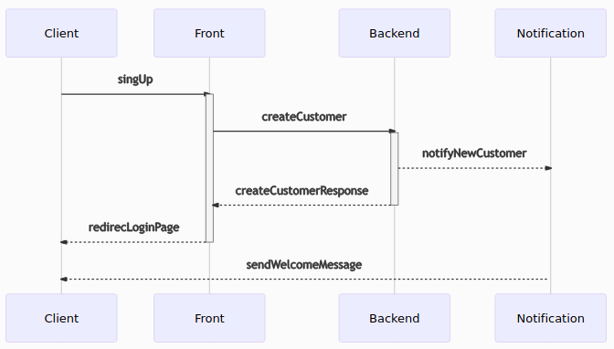
#### Cambio de contraseña.

El cambio de contraseña es otra de las opciones disparadas por el cliente, con la introducción de su correo en el formulario.

El sistema automáticamente mandará una nueva contraseña que podrá ser cambiada posteriormente en el formulario de actualización de cliente.

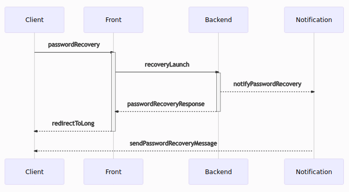

#### Cancelación de la cuenta de un usuario.

El usuario tiene la posibilidad de desactivar su cuenta en la interfaz de información de usuario.

El flujo que dispará la desactivación es el envío de un email con la notificación de desactivado de cuenta.

Informando que el sistema pasara a borrar la cuenta permanentemente en 60 días.

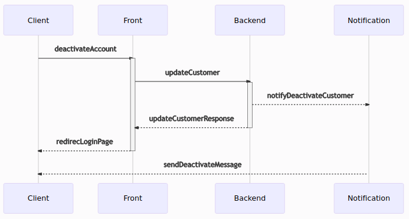

## Integración con la pasarela de pago.

La integración con la pasarela de pago depende de un proveedor externo, en el caso que nos ocupa un banco.

El protocolo de pagos es muy estricto en este caso **optamos por no guardar información de pago** en nuestra página y **optar por un sistema conexión por redirección**, esto hará que el **nivel de información a guardar en nuestro sistema sea menos sensible**.

Además de tener que integrar (Según normativa de la comunidad Europea) un sistema de autenticación de doble factor.

Es una de las opciones que provee uno de los operadores mas importantes des españa [**_Redsys_**](https://pagosonline.redsys.es/modelos-de-integracion.html)

Entre los requisitos de seguridad más conocidos están los certificados de seguridad SSL, los Sistemas de Verificación de Dirección (AVS), además de las normas de seguridad reguladas por la Industria de las Tarjetas de Pago (PCI).

Toda la seguridad recaerá sobre la pasarela bancaría la cual nos devolverá el estado del pago mediante un callback a nuestra plataforma.

El sistema básico de redirección viene descrito en la siguiente ilustración:

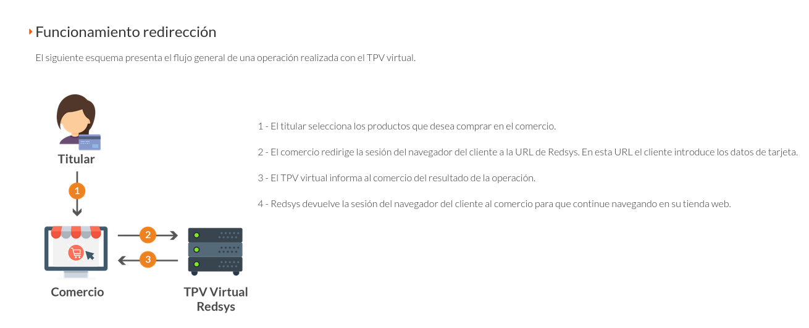

El diagrama de secuencia de la realización del pago, es el siguiente.

La información del flujo ha sido extraída de [**_Redsys_**](https://pagosonline.redsys.es/conexion-redireccion.html)

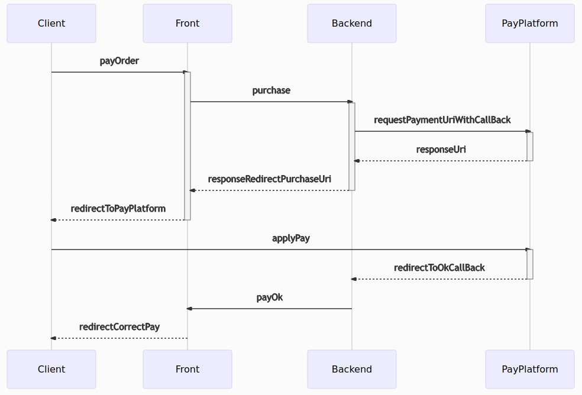

Las acciones se dispararan desde esta pantalla al seleccionar una forma de pago.

En la primera redirección el cliente entrará en la plataforma de pago donde podrá introducir sus datos bancarios.

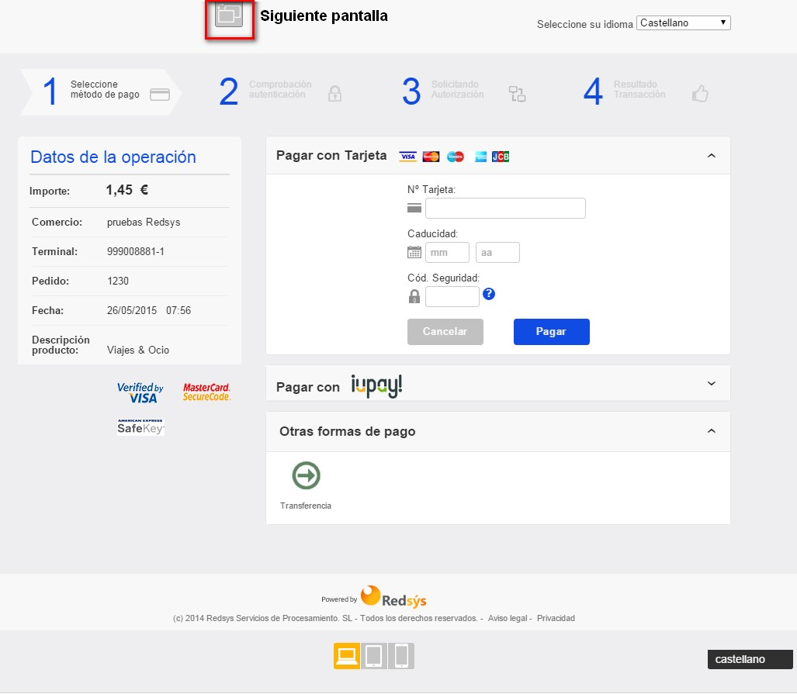

Una vez comprobados los datos la plataforma validará el pago y redirigirá al cliente a nuestra plataforma:

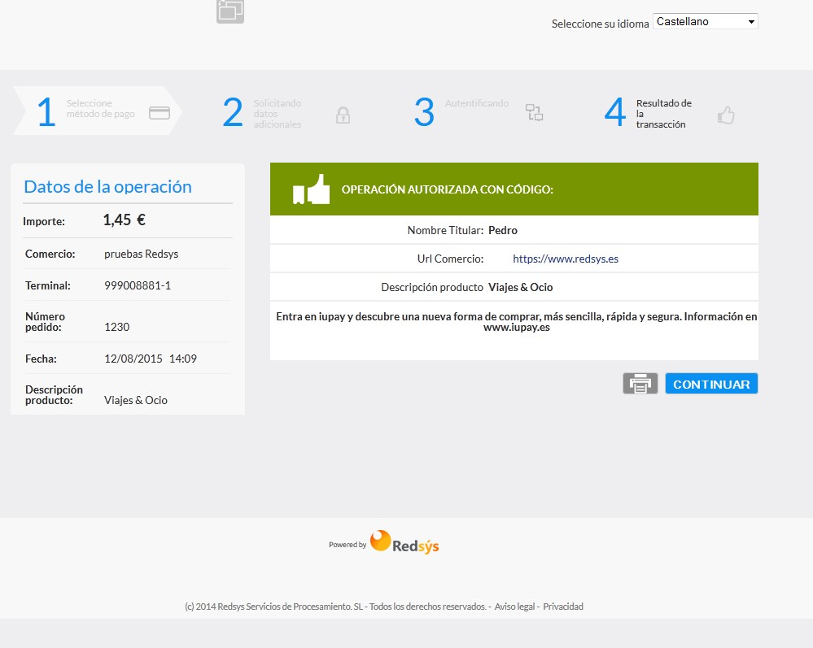

En caso de error el tpv mostrará al cliente una pantalla de error y lo indicará al sistema mediante una redirección

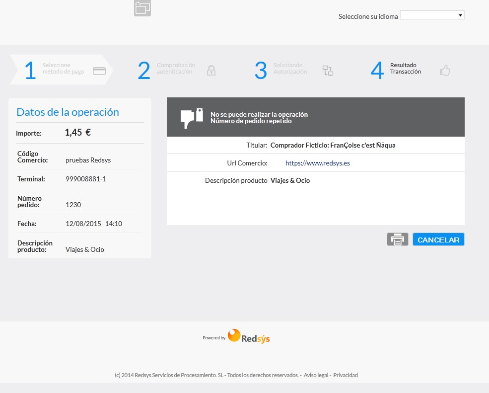

La plataforma nos ofrece la posibilidad de revisar las transacciones realizadas:

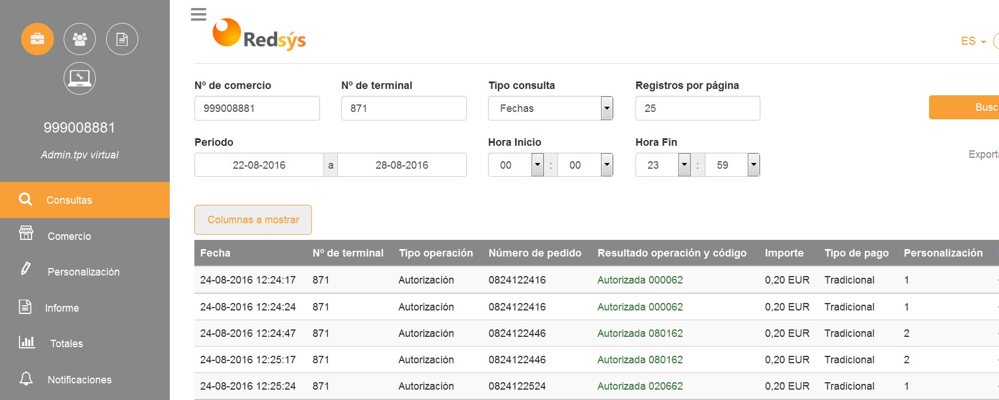

## Diagrama de la base de datos.

Debido a lo expuesto anteriormente no conservaremos en nuestro sistema tarjetas ni datos bancarios asociados al usuario.

Esto supone un ahorro de costes sobre la implementación así como una **descarga de responsabilidad en la plataforma bancaría** ante posibles intrusiones en nuestro sistema.

Para conservar la información de facturación que en este caso, si nos compete a nosotros, se han añadido las siguientes columnas a la tabla pedido.

Quedando de la siguiente manera:

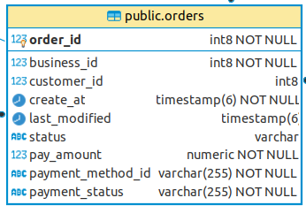

El diagrama completo de base de datos queda de la siguiente manera:

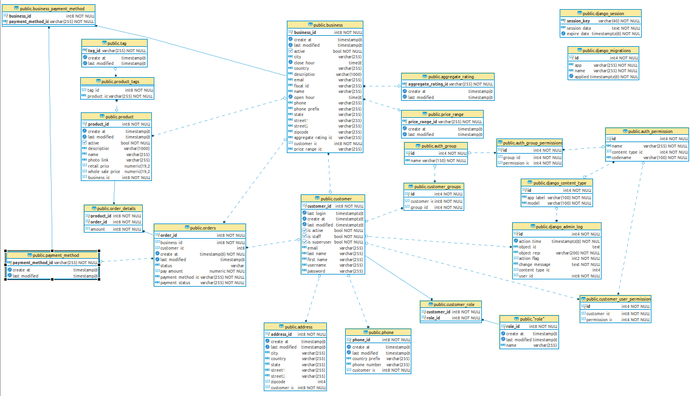