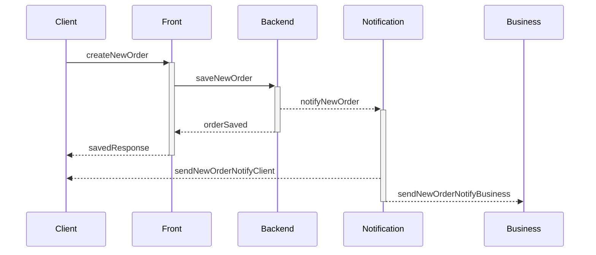
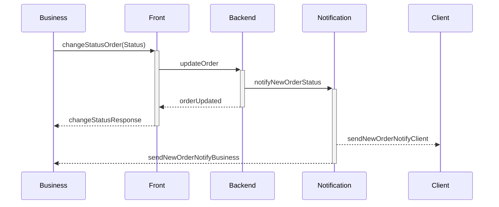
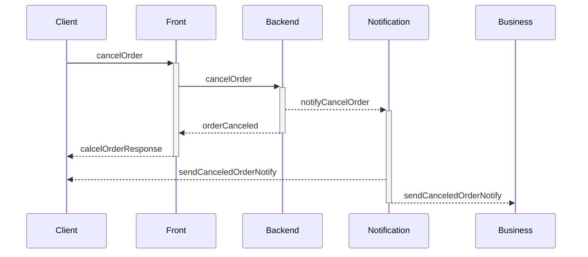

# Sistema de notificaciones

## Creación de un nuevo pedido

```mermaid
sequenceDiagram
    Client->>+Front: createNewOrder
    Front->>+Backend: saveNewOrder
    Backend-->>+Notification: notifyNewOrder
    Backend-->>-Front: orderSaved
    Front-->>-Client: savedResponse
    Notification-->>Client: sendNewOrderNotifyClient
    Notification-->>-Business: sendNewOrderNotifyBusiness
```

## Cambio de estado de un nuevo pedido

```mermaid
sequenceDiagram
    Business->>+Front: changeStatusOrder(Status)
    Front->>+Backend: updateOrder
    Backend->>+Notification: notifyNewOrderStatus
    Backend-->>-Front: orderUpdated
    Front-->>-Business: changeStatusResponse
    Notification-->>Client: sendNewOrderNotifyClient
    Notification-->>-Business: sendNewOrderNotifyBusiness
```

## Cambio de estado de un nuevo pedido

```mermaid
sequenceDiagram
    Client->>+Front: cancelOrder
    Front->>+Backend: cancelOrder
    Backend-->>+Notification: notifyCancelOrder
    Backend-->>-Front: orderCanceled
    Front-->>-Client: calcelOrderResponse
    Notification-->>Client: sendCanceledOrderNotify
    Notification-->>-Business: sendCanceledOrderNotify
```