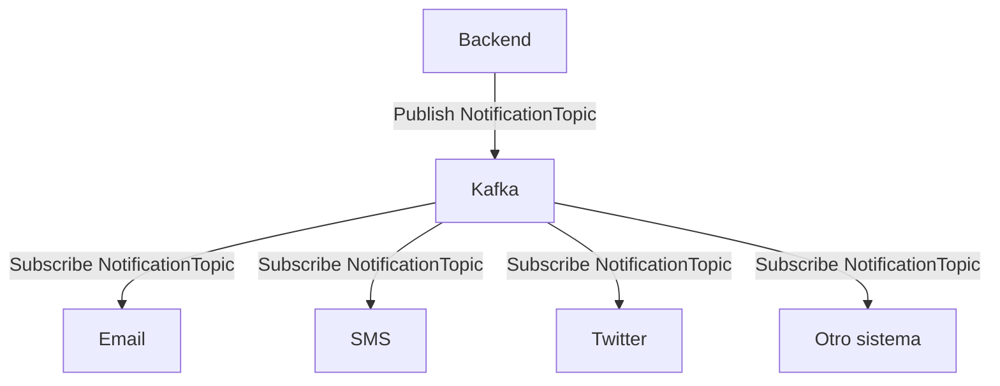

```mermaid
graph TD;
    A[Backend]-->|Publish NotificationTopic| B[Kafka];
    B-->|Subscribe NotificationTopic| C[Email];
    B-->|Subscribe NotificationTopic| D[SMS];
    B-->|Subscribe NotificationTopic| E[Twitter];
    B-->|Subscribe NotificationTopic| F[Otro sistema];
```